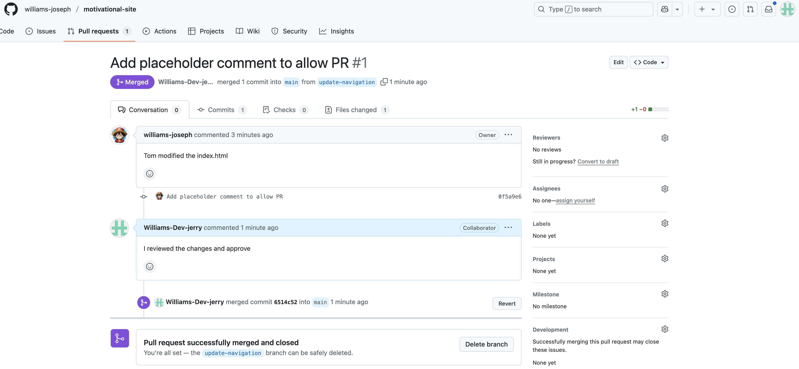

# Git Branching And Merging
---
This project continues the simulation of Tom and Jerry's work. The next thing is to `merge` both changes into the `main` project.

>Note: Separate Github accounts were used to simulate PR tasks.
---

### Tom Creates Pull Request(PR)
---
Tom navigates to the `update-navigation` branch and creates a PR for Jerry to review and approve before merging. The below screenshots outline the actions.

- **Switches to `update-navigation` branch**
---

- **Creates Pull Request**
---

---

### Jerry Creates Pull Request(PR)
---
Tom navigates to the `add-contact-info` branch and creates a PR for Jerry to review and approve before merging. The below screenshots outline the actions.

- **Switches to `add-contact-info` branch**
---

- **Creates Pull Request**
---

---
### Tom Reviews, Approves and Merges Jerry's PR
---

---
### Jerry Reviews, Approves and Merges Tom's PR
---

